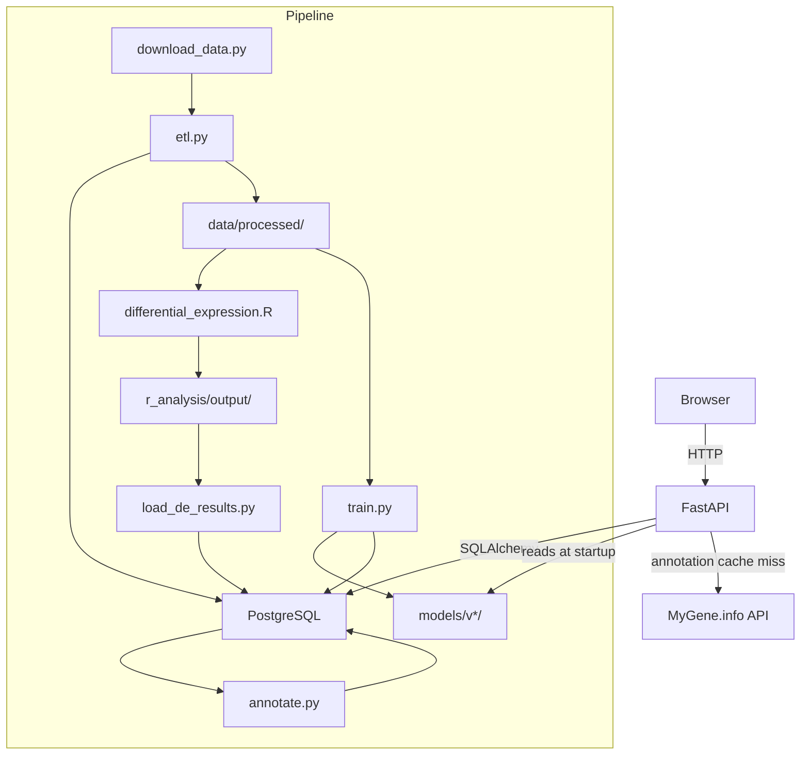

# lung-subtype-explorer

A FastAPI service for exploring TCGA lung cancer RNA-seq data. It serves expression distributions, differential expression results, and a subtype classifier trained on the same data. There is also a small web UI so you can look up any gene without touching the terminal.

## What this does

The TCGA program collected RNA-seq profiles from hundreds of lung adenocarcinoma (LUAD) and lung squamous cell carcinoma (LUSC) patients. This service lets you interactively explore which genes are differentially expressed between the two subtypes, see per-gene expression distributions, and run a subtype prediction from a custom expression vector.

The pipeline that feeds the database runs separately from the web server. Data comes from UCSC Xena, gets ETL'd into PostgreSQL, goes through R-based differential expression analysis (limma), and then XGBoost and logistic regression classifiers are trained on the top DE genes. SHAP values computed after training give a ranked list of the most informative genes, which you can browse on the top genes page.

## Architecture



The web server only reads from the database and model directory. All heavy computation (ETL, DE analysis, training) runs as standalone scripts before the server starts.

## Classifier details

`pipeline/train.py` trains two classifiers on the top 500 limma DE genes (ranked by `adj.P.Val` ascending):

| Component | Choice |
|-----------|--------|
| Scaling | `StandardScaler` (fitted on train split only) |
| Logistic regression | `max_iter=1000` |
| XGBoost | `n_estimators=200`, `max_depth=4`, `lr=0.1`, `subsample=0.8`, `colsample_bytree=0.8` |
| Evaluation | Stratified 5-fold CV on train + held-out 20% test split |
| Metrics reported | Accuracy, ROC AUC, F1, precision, recall |
| Interpretability | TreeSHAP (`shap.TreeExplainer`) on the test set |

The XGBoost model is what the `/predict` endpoint serves. Logistic regression is trained for comparison and its artifact (`lr.joblib`) is saved alongside.

Metrics are written to `models/v<timestamp>/metrics.json` when you run `make train`. The `data/` and `models/` directories are gitignored, so no numbers are hardcoded here.

TODO(animesh): add held-out test ROC AUC and 5-fold CV AUC after running the full pipeline on TCGA data.

## Data source and licensing

RNA-seq data comes from the GDC TCGA LUAD and LUSC cohorts, downloaded via UCSC Xena (https://xenabrowser.net/). Xena serves GDC-normalized counts in log2(normalized_count + 1) format. Clinical metadata is also from Xena.

TCGA data is publicly available but requires agreement to the TCGA Data Use Certification for controlled-access tiers. The gene expression matrices used here are open-access (no dbGaP application needed). When citing, reference the TCGA Research Network and the GDC data portal.

Patient data is never committed to this repository. The `data/` and `models/` directories are gitignored.

## Reproducing from scratch

You need Docker, Docker Compose, Python 3.11+, and R with limma installed (or the r-analysis Docker image handles this).

### 1. Start the database

```bash
make up
make migrate
```

This starts PostgreSQL and the API container, then applies Alembic migrations.

### 2. Download and load expression data

```bash
make download-data
make etl
```

`download_data.py` fetches the Xena matrices and clinical TSVs into `data/raw/`. `etl.py` parses barcodes, normalizes sample types, filters low-variance genes, and writes the result to `data/processed/` as Parquet files. It also bulk-inserts samples, genes, and expression values into PostgreSQL.

### 3. Differential expression

```bash
make de
```

This runs the R script via Docker (limma on the log2-transformed expression matrix) and then calls `load_de_results.py` to insert the results into the `de_results` table.

### 4. Train the classifiers

```bash
make train
```

Trains StandardScaler + XGBoost and logistic regression pipelines on the top DE genes, runs 5-fold cross-validation, computes SHAP values, and writes all artifacts to `models/v<timestamp>/`. The top genes by mean |SHAP| are also inserted into the `top_genes` table.

### 5. Pre-populate gene annotations

```bash
make annotate
```

Calls MyGene.info for the top DE and SHAP genes and caches results in `gene_annotations`. This makes annotation lookups in the UI fast without hitting the external API on every request.

### 6. Check it works

```bash
curl http://localhost:8000/health
# {"status":"ok","database":"ok"}
```

Then open http://localhost:8000 in a browser.

Or run the full pipeline in one shot (after `make up && make migrate`):

```bash
make pipeline
```

## Dev commands

| Command | Description |
|---|---|
| `make up` | Build and start all Docker services |
| `make down` | Stop and remove containers |
| `make test` | Run the pytest test suite |
| `make coverage` | Run tests with coverage report (outputs HTML to htmlcov/) |
| `make lint` | ruff lint and format check |
| `make migrate` | Apply Alembic migrations inside the running API container |
| `make pipeline` | Run the full pipeline end to end (download, ETL, DE, train, annotate) |

## Running tests without Docker

Tests use SQLite in memory and a fake model, so you do not need a running database or the actual TCGA data.

```bash
pip install -e ".[dev]"
pytest tests/ -v
```

## API endpoints

| Method | Path | Description |
|--------|------|-------------|
| GET | `/health` | Database and service health check |
| GET | `/genes/{symbol}` | Gene annotation from MyGene.info (cached) |
| GET | `/genes/{symbol}/expression` | Per-cohort expression distribution (box-plot data) |
| GET | `/genes/top` | SHAP-ranked top genes with DE stats and annotations |
| POST | `/predict` | Predict LUAD/LUSC from a JSON `{gene: log2_value}` feature vector |
| POST | `/predict/upload` | Predict from a two-column CSV (`gene_symbol,value`) |

## A note on the differential expression approach

The Xena expression matrix is already log2(normalized_count + 1), so limma runs directly on these values rather than using limma-voom on raw counts. This is appropriate because limma assumes approximately normal input, which the log transform achieves. The key thing to get right is using `sort.by = "p"` (raw p-value) in `topTable()` rather than `"adj.P.Val"`. Both produce the same gene ranking because Benjamini-Hochberg correction is monotone, but sorting by `adj.P.Val` silently breaks in some versions of limma when there are tied adjusted values.

The DE comparison is LUSC vs LUAD, so positive logFC means higher expression in LUSC and negative means higher in LUAD. The top genes page labels these accordingly.

## What I learned

**RNA-seq normalization.** Raw counts are dominated by library size differences between samples, so any comparison needs normalization. The Xena pipeline uses GDC's normalization (FPKM or similar), and the log2 pseudocount transform stabilizes variance for genes with low counts. The "+1" before taking log avoids undefined log(0) and reduces extreme outliers for low-count genes.

**LUAD vs LUSC biology.** These are both non-small-cell lung cancers but they have different cells of origin. LUAD originates in peripheral glandular cells and is associated with TTF1/NKX2-1 and EGFR/KRAS mutations. LUSC originates in central airway squamous cells and is marked by TP63, KRT5, KRT6, and SOX2 amplification. After training, KRT family members and TP63-related markers consistently ranked as top SHAP discriminators, which matches the biology.

**SHAP for interpretability.** Permutation importance can mislead when features are correlated, because importance splits across correlated predictors. TreeSHAP (what the `shap` library uses for XGBoost) computes exact Shapley values efficiently and distributes credit more fairly. For this dataset the global feature importance (mean |SHAP|) agreed well with published LUAD vs LUSC marker literature.

**FastAPI dependency injection for testing.** Refactoring the database session and httpx client to use `Depends()` and overriding `app.dependency_overrides` in the test fixture made the tests much cleaner. The module-scoped fixture that seeds SQLite once and reuses it for all API tests keeps the suite fast.

## Environment variables

| Variable | Default | Description |
|---|---|---|
| `DATABASE_URL` | see `app/core/config.py` | SQLAlchemy connection string |
| `DEBUG` | `false` | FastAPI debug mode |
| `LOG_LEVEL` | `INFO` | Logging level |
| `POSTGRES_USER` | `lung_user` | PostgreSQL user (compose only) |
| `POSTGRES_PASSWORD` | `lung_password` | PostgreSQL password (compose only) |
| `POSTGRES_DB` | `lung_transcriptomics` | PostgreSQL database name (compose only) |
